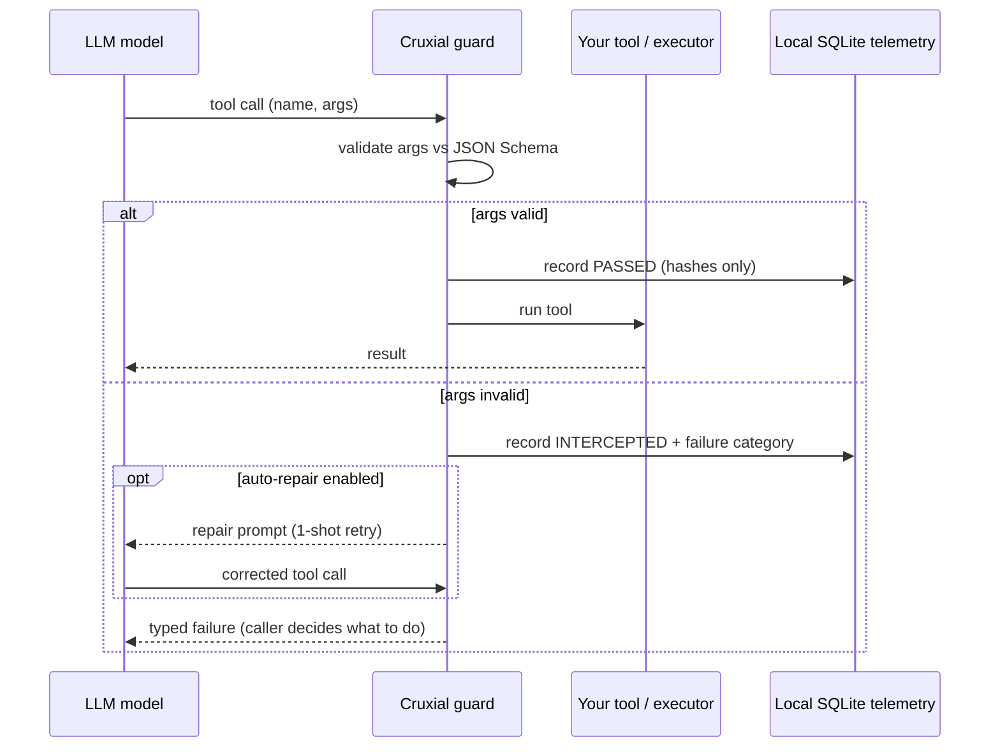

# Cruxial

[](https://github.com/cruxial-ai/cruxial/actions/workflows/tests.yml)
[](https://pypi.org/project/cruxial/)
[](https://pypi.org/project/cruxial/)
[](LICENSE)
[](https://socket.dev/pypi/package/cruxial)

**The reliability layer for LLM tool calls.**

Your agent said it sent the email. It didn't.

Cruxial intercepts every LLM tool call before it executes. It validates the
arguments against your schema and auto-repairs hallucinated args with a
structured retry. Drop-in for OpenAI and Anthropic. Overhead is under 1ms p99,
because validation runs locally with no extra network hop. It fails open by
default: if Cruxial itself errors, your tool still runs.

```bash
pip install cruxial
```

Then watch it catch every failure category live — offline, no API key:

```bash
cruxial demo
```


## 30-second demo

```python
import json
from cruxial import guard
from openai import OpenAI

client = OpenAI()

# Standard OpenAI tool definitions
schemas = {
    "send_email": {
        "type": "object",
        "properties": {
            "to": {"type": "string", "format": "email"},
            "subject": {"type": "string", "maxLength": 200},
            "body": {"type": "string"},
        },
        "required": ["to", "subject", "body"],
    }
}

# Your actual executors
def send_email(to, subject, body):
    return mailer.send(to=to, subject=subject, body=body)

executors = {"send_email": send_email}

# Wrap once
cruxial = guard(schemas=schemas, executors=executors)

# In your agent loop:
for tool_call in llm_response.tool_calls:
    args = json.loads(tool_call.arguments)   # OpenAI returns arguments as a JSON string
    result = cruxial.execute(tool_call.name, args)

    if not result.ok:
        # result.failure.category says why (e.g. "type_mismatch"); for an executor
        # error the raw exception is on result.error.
        result.raise_on_failure()        # raises the right typed error either way

    use(result.value)
```

## Or: one call does the whole turn

`guard()` gives you full control. If you write the usual raw-SDK loop, `cruxial.run()`
does the entire tool step in one call: it calls the model, validates every tool call,
executes the valid ones, auto-repairs the bad ones in one round-trip, then logs and
appends the results. Works with OpenAI, Azure, Anthropic, and LiteLLM. You keep your loop:

```python
import cruxial

result = cruxial.run(
    client,                 # your OpenAI / AzureOpenAI / Anthropic client, or litellm.completion
    model="gpt-4o",
    messages=messages,
    tools=tools,            # the same tool defs you already pass the LLM
    executors=executors,    # {tool_name: your_function}
)

while not result.finished:  # your loop stays yours — one model call per turn
    result = cruxial.run(client, model="gpt-4o", messages=result.messages,
                         tools=tools, executors=executors)

print(result.text)          # the model's final answer
```

It reuses your configured client (Azure endpoint, `base_url`, timeouts all preserved),
derives schemas from `tools`, and fails open. Deliberately **one turn, not a framework** —
no streaming, no multi-turn ownership, you decide when to stop. Need to own execution?
Drop to `guard().check()` / `.execute()`.

## What it catches

Eight failure categories. Every interception is logged with the failure
category — never the raw argument values.

| Category | What it catches |
|---|---|
| `missing_required` | Required field not in args |
| `type_mismatch` | Wrong type (`int` instead of `str`, etc.) |
| `enum_violation` | Value not in allowed enum |
| `format_violation` | Bad email / uri / date format, or a `pattern` mismatch |
| `constraint_violation` | maxLength / minimum / multipleOf / etc. |
| `extra_field` | Model invented a field that doesn't exist |
| `unknown_tool` | Tool name not in registry |
| `tool_bypass` | **Model *claimed* it did something but emitted no call** — "your agent said it sent the email. It didn't." |

The first seven are schema-derivable. **`tool_bypass`** is the one validators
structurally can't catch — there's no call to validate. See below.

## tool_bypass — catch the action your agent claimed but never took

A model says *"I've sent the email"* and emits **no `send_email` call**. No
call ever goes out — so no error, no log, nothing to grep for. The silent
failure. `cruxial.run()` catches it:

```python
result = cruxial.run(client, model="gpt-4o", messages=messages,
                     tools=tools, executors=executors)   # bypass check is on by default

if result.bypass:        # the model claimed an action and, when re-prompted, confirmed it
    print("caught a bypass:", result.bypass.tool)
```

**How it works (zero cost on normal turns):** a final text turn is flagged
*only* when it claims a completed action (`"sent"`, not `"send"`), attributed
to the assistant (not *"you"* / *"the scheduler"* / *"automatically"*), for a
side-effecting tool that was never called. A flagged turn gets **one neutral
re-prompt** — the model either re-emits the call (corrected + executed) or
declines (we do nothing). We only ever act on a model-confirmed re-emission, so
we never fabricate an action.

Benchmarked on a 132-scenario adversarial set ([BENCHMARKS.md](BENCHMARKS.md)):
**0 false actions**, acted-on precision **100%** (sonnet-4-6 and gpt-4o), 100% correction
recall *on that set*. It's precision-first — it fires on completion-form verbs, so terse
claims ("Done.", "Email's out.") are a documented recall gap: a high-quality net, not a
complete guarantee. `bypass="off"` disables it; `bypass="strict"` is a 2-call variant.

## Auto-repair

`cruxial.run()` already auto-repairs for you. If you use `guard()` directly,
call the adapter helper with the failure context:

```python
from cruxial.adapters.openai import auto_repair

cruxial = guard(schemas=schemas, executors=executors)
result = cruxial.execute(name, args)

if not result.ok:
    # 1-attempt structured retry — feeds the failure back to the model
    new_args = auto_repair(
        client,
        model=model,
        messages=messages,            # conversation incl. the assistant tool-call turn
        tools=tools,                  # the same tool defs you sent the model
        failure=result.failure,
        failed_args=args,
        repair_prompt=cruxial.build_repair_prompt(result.failure, args),
    )
    result = cruxial.execute_repaired(name, new_args)
```

Roughly **90% of intercepted calls are fixed in a single repair round-trip**
on the pooled live-MCP benchmark (87–94% per run on current code). Every number
is sourced in [BENCHMARKS.md](BENCHMARKS.md).

## See your interception rate

Every interception is written to a local SQLite file (no data leaves your
machine). To see your real rate:

```bash
cruxial stats
```

**Stats are project-local automatically** — inside a project (a dir with `.git/`,
`pyproject.toml`, `setup.py`, or `.cruxial/`) the DB lives at `./.cruxial/telemetry.sqlite`,
so each app stays separate; elsewhere it falls back to `~/.cruxial/`. Override with
`CRUXIAL_DB_PATH`; `cruxial diagnostic` shows the active path.

Output:

```
cruxial · last 24h
─────────────────────────────────────────
  total calls           1,247
  intercepted             184  (14.8%)
  auto-repaired           167  (90.8% of intercepted)
  passed through        1,063

top failing tools                    rate
  send_email                        23.1%
  create_calendar_event             18.4%
  search_web                         9.2%

top failure categories
  type_mismatch                       62
  missing_required                    44
  enum_violation                      38
  format_violation                    24
  constraint_violation                16
```

`cruxial stats` also shows the registry independently of traffic — handy for the
"is it even on?" check after install:

```
  registry              6 registered  ·  3 fired  ·  1 intercepted
```

Traffic but 0 interceptions usually means a well-behaved model on a simple schema —
`cruxial.testing.violation_payloads(schema)` fires a synthetic violation per category
to verify end-to-end.

## How it works



Cruxial wraps the **tool registry**, not the LLM client. No monkey-patching,
no proxies, no framework lock-in.

## Schema source — if your LLM sees a trimmed schema

If you keep two views of a tool schema — a **canonical** one for execution and a
**trimmed** one sent to the LLM — register the *trimmed* one. The LLM can only satisfy
the schema it was shown; validating against canonical fields it never saw turns
`missing_required` / `extra_field` into false positives.

```python
# Right
cruxial = guard(schemas=tool_definitions_sent_to_llm)

# Must use the canonical schema? Opt in — validation is unchanged, but it warns at
# construction and tags every telemetry row (visible in `cruxial stats`) to filter later:
cruxial = guard(schemas=canonical_definitions,
                config=GuardConfig(schema_origin="canonical"))
```

## Privacy

By default Cruxial stores: tool name, schema fingerprint, failure category,
timing. **Never the argument values themselves.** Hashes only.

The interceptor runs in your process. Your data never leaves your
infrastructure unless you opt into Cruxial Cloud (coming soon).

## Define tools as Pydantic models

Already model your tools with Pydantic? Skip the hand-written JSON Schema —
cruxial extracts it for you. Optional: `pip install cruxial[pydantic]` (v2).

```python
from pydantic import BaseModel, Field
from cruxial.adapters.pydantic import guard_models, tool_schema

class SendEmail(BaseModel):
    """Send an email to a recipient."""
    to: str = Field(pattern=r"^[^@\s]+@[^@\s]+\.[^@\s]+$")
    subject: str = Field(min_length=1, max_length=200)
    body: str

# One source of truth → both the runtime guard and the LLM tool definition
cruxial = guard_models({"send_email": SendEmail}, executors={"send_email": send_email})
tools   = [tool_schema(SendEmail, name="send_email")]                       # OpenAI format
# tools = [tool_schema(SendEmail, name="send_email", provider="anthropic")]  # Anthropic
```

Works with `run()` too — `run()` derives the schema from `tools`, so the whole
managed turn (validate → execute → auto-repair) runs against your model:

```python
from cruxial import run
run(client, model="gpt-4o", messages=msgs,
    tools=[tool_schema(SendEmail, name="send_email")],
    executors={"send_email": send_email})
```

Nested models and enums (Pydantic's `$defs`/`$ref`) validate end to end. The
adapter is lazy and optional — cruxial's core never requires Pydantic.

## What ships today (v0.4)

- ✅ Python SDK
- ✅ OpenAI + **Azure OpenAI** + Anthropic + LiteLLM (auto via normalization)
- ✅ JSON Schema validation
- ✅ 7 schema-validation categories (+ `tool_bypass` below = 8 total)
- ✅ 1-attempt auto-repair
- ✅ Local SQLite + stdout telemetry
- ✅ `cruxial stats` CLI
- ✅ Fail-open by default
- ✅ `cruxial.run()` — one managed turn (OpenAI / Azure / Anthropic / LiteLLM)
- ✅ **`tool_bypass` detection** — the claimed-but-never-called catch
- ✅ **Pydantic adapter** — define tools as Pydantic models (`cruxial[pydantic]`)

Coming:
- TypeScript SDK
- LangChain, LlamaIndex, AutoGen adapters
- Hosted dashboard with cross-customer schema drift alerts
- Zod (TypeScript) validators

## Questions or feedback?

Open a [GitHub issue](https://github.com/cruxial-ai/cruxial/issues), or reach the
maintainers on [Discord](https://discord.gg/qJu7yq54s). We'd especially like to hear
from anyone running Cruxial in a real agent — early design-partner feedback shapes
the roadmap.

## License

MIT. The SDK runs entirely in your process. The hosted dashboard (Cruxial
Cloud) will be a separate paid product. The interceptor itself stays MIT
forever.
