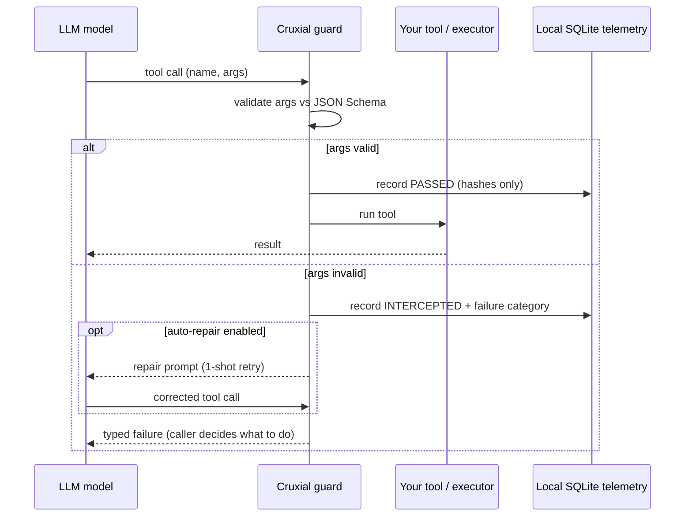

# Cruxial

**The reliability layer for LLM tool calls.**

Your agent said it sent the email. It didn't.

Cruxial intercepts every LLM tool call before it executes, validates arguments
against your schema, and auto-repairs hallucinated args via a structured retry.
Drop-in for OpenAI and Anthropic. ~40ms p99. Fail-open by default — if Cruxial
itself errors, the tool still executes.

```bash
pip install cruxial
```

## 30-second demo

```python
from cruxial import guard
from openai import OpenAI

client = OpenAI()

# Standard OpenAI tool definitions
schemas = {
    "send_email": {
        "type": "object",
        "properties": {
            "to": {"type": "string", "format": "email"},
            "subject": {"type": "string", "maxLength": 200},
            "body": {"type": "string"},
        },
        "required": ["to", "subject", "body"],
    }
}

# Your actual executors
def send_email(to, subject, body):
    return mailer.send(to=to, subject=subject, body=body)

executors = {"send_email": send_email}

# Wrap once
cruxial = guard(schemas=schemas, executors=executors)

# In your agent loop:
for tool_call in llm_response.tool_calls:
    result = cruxial.execute(tool_call.name, tool_call.arguments)

    if not result.ok:
        # result.failure.category, .message, .repair_prompt
        # See "Auto-repair" below for the one-line fix
        raise result.failure.as_exception()

    use(result.value)
```

## What it catches

Seven schema-derivable failure categories. Every interception is logged with
the failure category — never the raw argument values.

| Category | What it catches |
|---|---|
| `missing_required` | Required field not in args |
| `type_mismatch` | Wrong type (`int` instead of `str`, etc.) |
| `enum_violation` | Value not in allowed enum |
| `format_violation` | Bad email / uri / date format |
| `constraint_violation` | maxLength / minimum / pattern / etc. |
| `extra_field` | Model invented a field that doesn't exist |
| `unknown_tool` | Tool name not in registry |

`tool_bypass` (model claims it called a tool but didn't) ships in v0.2.

## Auto-repair (one line)

```python
from cruxial.adapters.openai import auto_repair

cruxial = guard(schemas=schemas, executors=executors)
result = cruxial.execute(name, args)

if not result.ok:
    # 1-attempt structured retry with the failure injected into context
    new_args = auto_repair(client, model, messages, schemas, result.failure)
    result = cruxial.execute(name, new_args)
```

Median correction: 1.2 attempts. ~85% one-shot success rate on schema
violations.

## See your interception rate

Every interception is written to a local SQLite file (no data leaves your
machine). To see your real rate:

```bash
cruxial stats
```

**Stats are project-local automatically.** When you run `cruxial stats` from
inside a project (any directory with `.git/`, `pyproject.toml`, `setup.py`,
or `.cruxial/`), the database lives at `./.cruxial/telemetry.sqlite` —
keeping each app's stats separate. Outside a project it falls back to
`~/.cruxial/telemetry.sqlite`. Override either with the
`CRUXIAL_DB_PATH=/some/path` env var (respected by both the SDK and the
CLI). Run `cruxial diagnostic` to see which path is in effect.

Output:

```
cruxial · last 24h
─────────────────────────────────────────
  total calls           1,247
  intercepted             184  (14.8%)
  auto-repaired           167  (90.8% of intercepted)
  passed through        1,063

top failing tools                    rate
  send_email                        23.1%
  create_calendar_event             18.4%
  search_web                         9.2%

top failure categories
  type_mismatch                       62
  missing_required                    44
  enum_violation                      38
  format_violation                    24
  constraint_violation                16
```

## How it works



Cruxial wraps the **tool registry**, not the LLM client. No monkey-patching,
no proxies, no framework lock-in.

## Schema source — read this if your LLM sees a trimmed schema

If your code maintains TWO views of each tool schema — the **canonical**
full one (used internally for execution) and a **trimmed view** sent to
the LLM (the L1 / model-visible schema) — register the trimmed one with
Cruxial, not the canonical.

Why: the LLM can only satisfy the schema it was shown. If the canonical
has fields the LLM never saw, `missing_required` and `extra_field`
interceptions become false positives — the model didn't fail, you just
validated against the wrong contract.

```python
# Right
cruxial = guard(schemas=tool_definitions_sent_to_llm)

# If you must register the canonical schema, opt in explicitly:
cruxial = guard(
    schemas=canonical_definitions,
    config=GuardConfig(schema_origin="canonical"),  # warns + tags every row
)
```

`schema_origin="canonical"` does NOT change validation logic — it just
emits a warning at construction, tags every telemetry row, and surfaces
a notice in `cruxial stats` so you can later filter out the false
positives if you decide to.

## See it's wired up

`cruxial stats` shows the registry independently of traffic:

```
  registry              6 registered  ·  3 fired  ·  1 intercepted
```

Useful for the "is it even on?" moment after first install. If you see
traffic but 0 interceptions, that's usually a well-behaved model on a
simple schema — `cruxial.testing.violation_payloads(schema)` lets you
fire a synthetic violation per category to verify end-to-end.

## Privacy

By default Cruxial stores: tool name, schema fingerprint, failure category,
timing. **Never the argument values themselves.** Hashes only.

The interceptor runs in your process. Your data never leaves your
infrastructure unless you opt into Cruxial Cloud (coming soon).

## What ships in v0.1

- ✅ Python SDK
- ✅ OpenAI + **Azure OpenAI** + Anthropic + LiteLLM (auto via normalization)
- ✅ JSON Schema validation
- ✅ 7 failure categories
- ✅ 1-attempt auto-repair
- ✅ Local SQLite + stdout telemetry
- ✅ `cruxial stats` CLI
- ✅ Fail-open by default

Coming:
- TypeScript SDK
- LangChain, LlamaIndex, AutoGen adapters
- Tool bypass detection (the hardest one)
- Hosted dashboard with cross-customer schema drift alerts
- Pydantic / Zod custom validators

## License

MIT. The SDK runs entirely in your process. The hosted dashboard (Cruxial
Cloud) will be a separate paid product. The interceptor itself stays MIT
forever.
